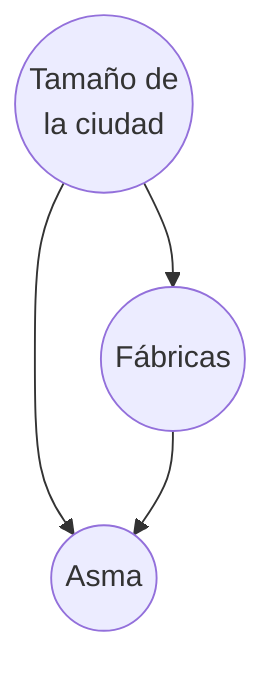
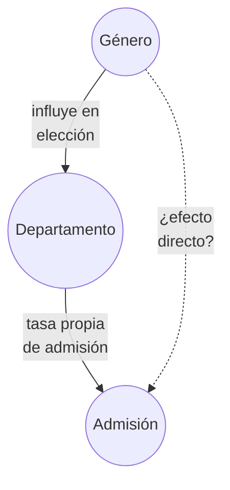
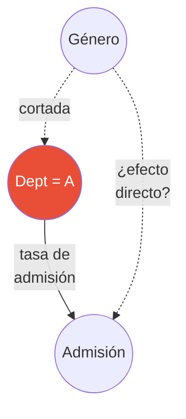
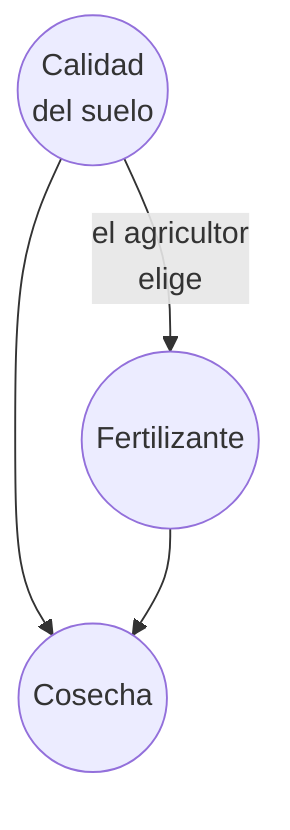
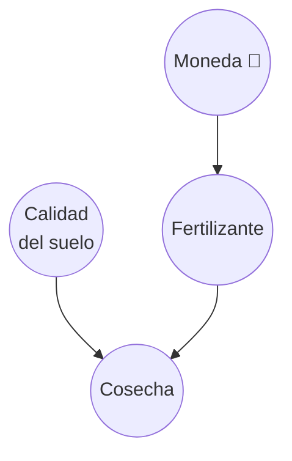
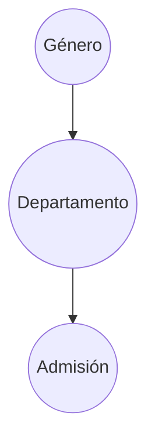
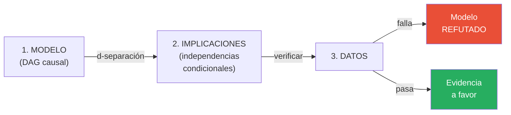
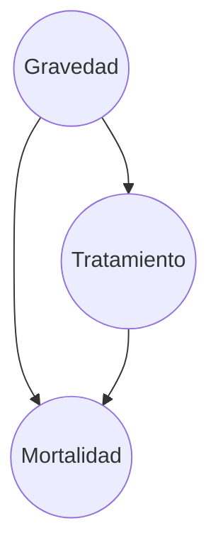
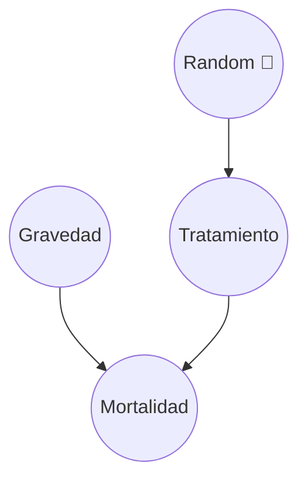

# Causalidad y el Operador do

> *"The question 'What would happen if we do X?' can never be answered from data alone, no matter how large the dataset."*
> — Judea Pearl

---

## Observar vs. Intervenir

Hay una diferencia fundamental entre **ver** que algo ocurre y **hacer** que ocurra. La probabilidad clásica no distingue entre ambas.

```
OBSERVAR                              INTERVENIR
────────                              ──────────
"La gente que lleva paraguas          "Si OBLIGAMOS a todos a
 se moja más"                          llevar paraguas,
                                       ¿se mojan más?"
P(mojado ∣ paraguas) alto
                                      P(mojado ∣ do(paraguas)) = P(mojado)
¿Por qué?
                                      ¿Por qué?
Porque la lluvia causa ambos:         Porque al forzar el paraguas,
 lluvia → paraguas                     rompemos la conexión con
 lluvia → mojarse                      la lluvia. El paraguas ya
                                       no es señal de lluvia.
La correlación es espuria.
                                      La intervención revela que
                                       el paraguas no causa mojarse.
```

La notación $do(X = x)$ fue introducida por Judea Pearl para formalizar esta distinción:

- $P(Y \mid X = x)$ — **probabilidad condicional**: ¿cuál es la probabilidad de $Y$ si *observo* que $X = x$?
- $P(Y \mid do(X = x))$ — **probabilidad intervencionista**: ¿cuál es la probabilidad de $Y$ si *fuerzo* $X = x$?

Estas dos cantidades pueden ser muy diferentes cuando hay confounders.

:::example{title="Observar vs. Intervenir: fábricas y asma"}
Imagina que observas que las ciudades con más fábricas tienen más casos de asma.

$$P(\text{asma} \mid \text{fábricas} = \text{muchas}) > P(\text{asma} \mid \text{fábricas} = \text{pocas})$$

¿Significa que las fábricas causan asma? No necesariamente. Tal vez las ciudades grandes tienen más fábricas **y** más autos (que también causan contaminación).



Para saber si las fábricas causan asma, necesitamos $P(\text{asma} \mid do(\text{fábricas} = \text{muchas}))$.
:::

---

## Cirugía de grafos

El operador $do(X = x)$ tiene una interpretación gráfica elegante: **corta todas las flechas que llegan a $X$** y fija su valor.

¿Por qué? Cuando *observamos* $X = x$, el valor de $X$ fue determinado por sus causas. Esas causas pueden estar correlacionadas con $Y$ por otros caminos. Pero cuando *intervenimos* y fijamos $X = x$, las causas de $X$ ya no importan — nosotros decidimos el valor.

### Ejemplo: Berkeley

**Grafo original** (observacional):



**Grafo mutilado** — $do(\text{Dept} = A)$:



Al hacer $do(\text{Dept} = A)$, cortamos la flecha Género → Departamento. Ahora el departamento no depende del género — **nosotros** lo fijamos. Esto nos permite medir el efecto directo del género sobre la admisión sin la distorsión del departamento.


**La regla general:**

$$do(X = x) \implies \text{eliminar todas las flechas} \rightarrow X \text{ y fijar } X = x$$

---

## La fórmula de ajuste

Si no podemos intervenir físicamente (no podemos asignar departamentos al azar), ¿podemos calcular $P(Y \mid do(X))$ a partir de **datos observacionales**?

Sí, si conocemos el confounder $Z$. La **fórmula de ajuste** (también llamada *backdoor adjustment*) dice:

$$P(Y \mid do(X = x)) = \sum_z P(Y \mid X = x, Z = z) \cdot P(Z = z)$$

Compárala con la probabilidad condicional ingenua:

$$P(Y \mid X = x) = \sum_z P(Y \mid X = x, Z = z) \cdot P(Z = z \mid X = x)$$

La diferencia está en **una sola cosa**:

| | Peso de cada estrato $z$ |
|---|---|
| **Causal** ($do$) | $P(Z = z)$ — distribución de la **población** |
| **Condicional** (ingenuo) | $P(Z = z \mid X = x)$ — distribución **sesgada** por $X$ |

:::example{title="La diferencia en una línea"}
En Berkeley, la estimación ingenua pondera cada departamento por *la fracción de mujeres que se postuló ahí*. Como las mujeres se postularon más a departamentos competitivos, el promedio ponderado **baja**.

La estimación causal pondera cada departamento por *la fracción general de solicitantes*, sin importar el género. Esto elimina el sesgo.
:::


### ¿Cuándo funciona esto?

> **Intuición backdoor (una línea):** Ajusta por confounders (forks). **Nunca** ajustes por colliders.

Ajustar por un confounder (fork) elimina la correlación espuria. Pero ajustar por un collider **crea** una correlación que no existía — exactamente lo contrario de lo que queremos.

---

## RCT: el operador $do$ con las manos

Un **Randomized Controlled Trial** (RCT, ensayo aleatorizado) es la forma más directa de implementar $do(X = x)$: usas una moneda (o un generador aleatorio) para decidir quién recibe el tratamiento.

:::example{title="RCT: fertilizante y cosecha"}
Un agricultor quiere saber si un fertilizante nuevo mejora la cosecha. Tiene 100 parcelas.

**Si observa sin intervenir:**

El agricultor echa más fertilizante en las parcelas con **mejor tierra** (porque quiere maximizar ganancias). ¿Resultado? El fertilizante parece funcionar muy bien, pero parte del efecto es de la tierra, no del fertilizante.



La calidad del suelo es un **confounder**: influye tanto en la decisión de fertilizar como en la cosecha. La estimación observacional $P(\text{cosecha} \mid \text{fertilizante})$ **sobreestima** el efecto del fertilizante.

**Si hace un RCT:**

El agricultor lanza una moneda para cada parcela: cara → fertilizante, cruz → sin fertilizante. La moneda no sabe nada sobre la calidad del suelo.



La aleatorización **corta** la flecha Suelo → Fertilizante. Ahora las parcelas con y sin fertilizante tienen, en promedio, la **misma calidad de suelo**. Cualquier diferencia en cosecha se debe al fertilizante.
:::


### ¿Por qué funciona la aleatorización?

La aleatorización ($R$) hace que $X$ sea **independiente de todos los confounders**:

$$R \perp Z \implies P(Y \mid X = x, R) = P(Y \mid do(X = x))$$

Es decir: en un RCT, la correlación observada **es** el efecto causal. No necesitas ajustar por nada.

### ¿Y cuándo NO puedes hacer un RCT?

- **Ética:** No puedes obligar a la gente a fumar para ver si causa cáncer
- **Costo:** No puedes aleatorizar políticas educativas a nivel país
- **Imposibilidad:** No puedes aleatorizar el género o la edad de las personas
- **Tiempo:** Algunos efectos tardan décadas en manifestarse

En todos estos casos, necesitas estimar $P(Y \mid do(X))$ a partir de datos observacionales, usando la fórmula de ajuste. Esa es la promesa de la **inferencia causal**: respuestas de tipo RCT sin necesidad de experimentar.

---

## Simpson resuelto

Volvamos a Berkeley. ¿Hay discriminación por género en las admisiones?

El grafo causal es:



El departamento es un confounder (fork). Aplicamos la fórmula de ajuste:

$$P(\text{adm} \mid do(\text{género} = \text{mujer})) = \sum_d P(\text{adm} \mid \text{mujer}, D = d) \cdot P(D = d)$$

Esto pondera cada departamento por su proporción **en la población total**, no por la proporción de mujeres. El resultado: **no hay evidencia de discriminación**. La diferencia agregada se debía a que las mujeres se postularon a departamentos más competitivos.

La fórmula de ajuste produce el mismo resultado que obtendríamos con un RCT (si pudiéramos asignar departamentos al azar). Esa es la magia: **respuestas experimentales a partir de datos observacionales**, siempre y cuando conozcamos el grafo causal correcto.

---

## Los datos no prueban causalidad

> **Advertencia fundamental:** No se puede inferir causalidad a partir de datos. Nunca. Sin importar cuántos datos tengas.

La causalidad viene del **modelo** (el DAG), no de los datos. El DAG codifica nuestras hipótesis sobre cómo funciona el mundo — qué causa qué. Los datos solo pueden hacer dos cosas:

1. **Refutar** el modelo (si las implicaciones del DAG no se cumplen en los datos)
2. **Ser consistentes** con el modelo (si las implicaciones sí se cumplen)

Pero ser consistente **no es lo mismo que probar**. Muchos DAGs diferentes pueden ser consistentes con los mismos datos.

### El marco de verificación



Todo modelo causal (DAG) implica ciertas **independencias condicionales** entre las variables, derivadas de las reglas de d-separación que vimos en las [estructuras causales](01_estructuras_causales.md):

| Estructura | Implicación testeable |
|---|---|
| **Fork** $X \leftarrow Z \rightarrow Y$ | $X \perp Y \mid Z$ — la correlación espuria desaparece al condicionar en $Z$ |
| **Chain** $X \rightarrow M \rightarrow Y$ | $X \perp Y \mid M$ — el flujo se bloquea al condicionar en el mediador |
| **Collider** $X \rightarrow C \leftarrow Y$ | $X \perp Y$ — son independientes sin condicionar en $C$ |

Estas implicaciones son **condiciones necesarias** para que el DAG sea correcto. Si no se cumplen en los datos, el modelo está mal. Si se cumplen, es evidencia a favor — pero no prueba, porque otros DAGs podrían implicar las mismas independencias.


### Independencia condicional: verificación visual

Podemos verificar una implicación de forma visual. En un fork puro ($X \leftarrow Z \rightarrow Y$, sin $X \rightarrow Y$), el DAG predice que $X \perp Y \mid Z$: la correlación entre $X$ e $Y$ debe desaparecer al condicionar en $Z$.


En la figura:
- **Panel izquierdo:** sin condicionar, $X$ e $Y$ parecen correlacionados (correlación ~0.7)
- **Panel central:** al colorear por terciles de $Z$, dentro de cada grupo la correlación casi desaparece
- **Panel derecho:** la correlación marginal (roja) es fuerte, pero las condicionales (por grupo de $Z$) son cercanas a cero

Si el DAG dijera que $X$ causa $Y$ directamente, la correlación **no** desaparecería al condicionar en $Z$. Este tipo de verificación nos permite distinguir entre DAGs alternativos.

### Diagnóstico de residuos: ¿cuál es la dirección causal?

El libro *Elements of Causal Inference* (Peters, Janzing, Schölkopf) propone una herramienta para verificar la **dirección** de una relación causal. La idea se basa en los modelos de ruido aditivo:

Si $X$ causa $Y$, entonces $Y = f(X) + N$ donde el ruido $N$ es independiente de $X$. Esto implica una **asimetría**:

| Dirección | Regresión | Residuos |
|---|---|---|
| **Causal** ($X \to Y$) | $Y = f(X) + \text{residuos}$ | Residuos **independientes** de $X$ (banda plana) |
| **Anti-causal** ($Y \to X$) | $X = g(Y) + \text{residuos}$ | Residuos **dependientes** de $Y$ (patrones visibles) |

La asimetría surge porque el mecanismo causal ($f$) y la distribución de la causa ($P(X)$) son **independientes** entre sí (principio de independencia causa-mecanismo). En la dirección anti-causal, esta independencia se rompe y los residuos muestran estructura.


En la figura:
- **Fila superior (causal):** los residuos de $Y \sim f(X)$ forman una banda plana alrededor de cero, sin estructura. La correlación es cercana a 0.
- **Fila inferior (anti-causal):** los residuos de $X \sim g(Y)$ muestran heteroscedasticidad (la varianza cambia con $Y$). La correlación es mayor.

:::example{title="Intuición: ¿por qué la asimetría?"}
Imagina que $X$ es la altitud de una estación meteorológica y $Y$ es la temperatura. La altitud causa la temperatura (a mayor altitud, menor temperatura).

- **Dirección causal:** La temperatura depende de la altitud mediante una ley física estable. El ruido (clima diario, microclima) es independiente de la altitud. Residuos planos.
- **Dirección anti-causal:** Si tratas de "predecir" la altitud a partir de la temperatura, la distribución de altitudes disponibles (hay más tierras bajas que montañas) interactúa con la función inversa. Residuos con estructura.

Este diagnóstico es una **condición necesaria**, no suficiente. Si los residuos muestran estructura en la dirección propuesta, hay evidencia en contra. Si son planos, es consistente — pero no prueba la dirección.
:::

---

## DoWhy: inferencia causal en Python

[DoWhy](https://www.pywhy.org/dowhy/) es una librería de código abierto (Microsoft Research) diseñada para inferencia causal. Implementa las ideas que vimos en este módulo de manera programática:

1. **Modelar:** defines el DAG causal como un grafo dirigido
2. **Identificar:** DoWhy aplica automáticamente el criterio backdoor para determinar qué variables ajustar
3. **Estimar:** calcula $P(Y \mid do(X))$ usando el método de ajuste apropiado
4. **Refutar:** valida la robustez del estimado con pruebas de sensibilidad

```python
import networkx as nx
from dowhy import CausalModel

grafo = nx.DiGraph([("Z", "X"), ("Z", "Y"), ("X", "Y")])
modelo = CausalModel(data=df, treatment="X", outcome="Y", graph=grafo)
identificado = modelo.identify_effect()    # encuentra backdoor: ajustar por Z
estimacion = modelo.estimate_effect(identificado, method_name="backdoor.linear_regression")
```

En el [notebook práctico](notebooks/causal_intro.ipynb) usamos DoWhy para estimar el efecto causal en datos sintéticos y comparar con la estimación manual.

**Referencias:**
- [Documentación oficial](https://www.pywhy.org/dowhy/)
- [Tutorial introductorio](https://www.pywhy.org/dowhy/main/getting_started/intro.html)
- [Repositorio en GitHub](https://github.com/py-why/dowhy)

---

:::exercise{title="Aplica lo aprendido"}
Un hospital observa que los pacientes que reciben un tratamiento nuevo (T) tienen mayor mortalidad que los que no lo reciben.



1. ¿Qué tipo de estructura forma Gravedad con respecto a Tratamiento y Mortalidad?
2. ¿Por qué la estimación ingenua $P(\text{mortalidad} \mid T = \text{sí})$ está sesgada?
3. Escribe la fórmula de ajuste para estimar $P(\text{mortalidad} \mid do(T = \text{sí}))$.
4. ¿Qué haría un RCT en este caso? Dibuja el grafo.
:::

<details>
<summary><strong>Ver Respuestas</strong></summary>

1. **Fork.** Gravedad → Tratamiento, Gravedad → Mortalidad. Es la misma estructura que Berkeley.

2. Los doctores dan el tratamiento a los pacientes más graves. Los pacientes graves tienen mayor mortalidad de todas formas. La estimación ingenua mezcla el efecto del tratamiento con el efecto de la gravedad.

3. $P(\text{mortalidad} \mid do(T = \text{sí})) = \sum_g P(\text{mortalidad} \mid T = \text{sí}, G = g) \cdot P(G = g)$

   Ponderamos por la distribución de gravedad en la **población**, no entre los que recibieron el tratamiento.

4. Un RCT asignaría el tratamiento al azar, sin importar la gravedad:



La aleatorización corta la flecha Gravedad → Tratamiento. Ahora el grupo tratado y el control tienen la misma distribución de gravedad.

</details>

---

**Anterior:** [Estructuras Causales](01_estructuras_causales.md) | **Siguiente:** [Notebook práctico →](notebooks/causal_intro.ipynb)
